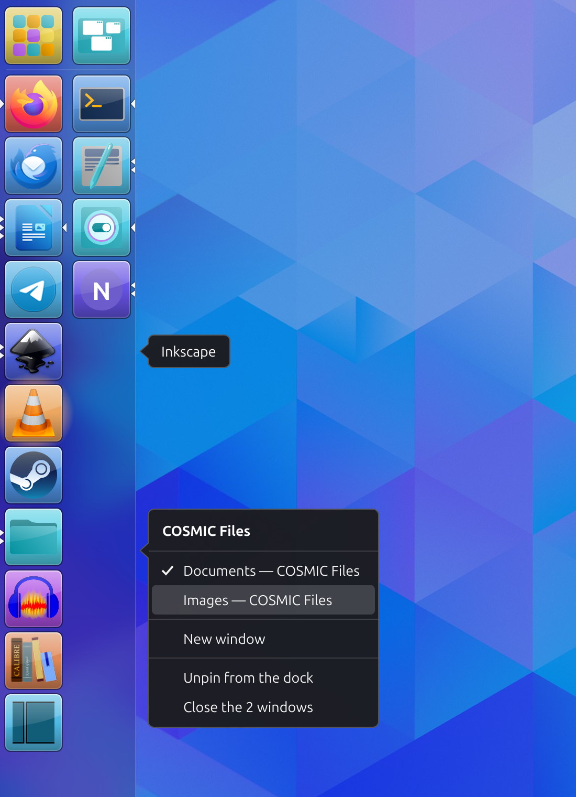

# Quai

[English](README.md) · Français

Un dock latéral à deux colonnes pour le bureau COSMIC, dans la présentation
du lanceur d'Unity (Ubuntu) : chaque tuile est éclairée de la couleur de son
icône.



- **Colonne de gauche** : les applications épinglées.
- **Colonne de droite** : les applications ouvertes qui ne sont pas épinglées,
  regroupées par application ou une tuile par fenêtre, au choix.

Largeur fixe de 130 px : deux lanceurs d'Unity côte à côte, dans ses
proportions par défaut (tuiles de 54 px, icônes de 48 px, 5 px d'intervalle).

## Usage

| Geste | Effet |
|---|---|
| Clic | lance l'application, ou revient à sa dernière fenêtre |
| Clic sur l'application en cours | passe à sa fenêtre suivante ; s'il n'y en a qu'une, la réduit |
| Clic du milieu | ouvre une nouvelle fenêtre |
| Clic droit sur une tuile | fenêtres, actions de l'application, épingler ou détacher, fermer |
| Clic droit ailleurs | réglages du dock |
| Glisser dans la colonne de gauche | épingle, ou change l'ordre |
| Glisser hors de la colonne de gauche | détache |
| Molette | fait défiler une colonne trop longue |
| Toucher (écran tactile) | comme un clic |
| Doigt maintenu sur une tuile | comme un clic droit : le menu s'ouvre sous le doigt |
| Doigt glissé | comme un glisser à la souris |

Les petites flèches reprennent celles d'Unity : sur le bord extérieur, une
par fenêtre ouverte (trois au plus) ; au centre, celle de l'application en
cours.

## Installation

Sur Pop!_OS et Ubuntu, depuis le même dépôt apt que les applications de
bureau Reader's ([funkypitt.github.io/apt-repo](https://funkypitt.github.io/apt-repo)) :

```sh
sudo apt install quai
```

Le paquet démarre Quai avec chaque session COSMIC, pour tous les utilisateurs,
dès la connexion suivante ; le `.deb` est aussi joint à chaque
[version](https://github.com/funkypitt/quai/releases). Sur Arch et Manjaro,
`packaging/PKGBUILD`.

Depuis les sources, il faut Rust (`rustup`) ; aucune autre dépendance :

```sh
./install.sh                     # compile, installe pour cet utilisateur, démarre avec la session
./uninstall.sh                   # retire Quai et rend le dock de COSMIC
```

Quai tourne comme service de la session (`systemctl --user status quai`),
relancé s'il tombe. Au démarrage il éteint le dock de COSMIC, pour qu'un seul
dock paraisse (`hide_cosmic_dock = false` dans les réglages garde les deux) ;
`quai --cosmic-dock on` rend le dock de COSMIC à tout moment.

## Réglages

`~/.config/quai/config.toml`, relu dès qu'il change. Les mêmes choix se font
par un clic droit sur le dock. Au premier lancement, les applications
épinglées du dock de COSMIC sont reprises.

| Clé | Valeurs | Rôle |
|---|---|---|
| `pinned` | liste | applications épinglées, de haut en bas |
| `group_windows` | `true`, `false` | à droite : une tuile par application ou par fenêtre |
| `backlight` | `"always"`, `"running"` | toutes les tuiles éclairées (Unity), ou seulement les applications ouvertes |
| `click_active` | `"minimize"`, `"cycle"` | effet d'un clic sur l'application en cours |
| `buttons` | `true`, `false` | boutons Applications et Espaces de travail |
| `opacity` | 0.0 à 1.0 | fond du dock |
| `tint` | `"wallpaper"`, `"none"`, `"#rrggbb"` | couleur du dock : tirée du fond d'écran (Unity), presque noire, ou choisie |
| `blur` | `true`, `false` | flou derrière le dock |
| `output` | `"all"` ou un nom d'écran | écrans où le dock paraît |
| `icon_theme` | nom | vide : le thème du bureau |
| `hide_cosmic_dock` | `true`, `false` | éteindre le dock de COSMIC au démarrage de Quai |

## Limites connues

- Les fenêtres de tous les espaces de travail sont montrées.
- Les protocoles `zcosmic_*` de COSMIC ne sont pas stables : une mise à jour
  de COSMIC peut demander d'adapter Quai (la version de la bibliothèque est
  figée dans `Cargo.toml`).
- Essayé sur un seul écran, à l'échelle 100 %. Le toucher passe par le même
  chemin que la souris, mais n'a pas encore été essayé sur un écran tactile.

## Développement

```sh
cargo test
cargo run -- --preview apercu.png      # dessine le dock dans une image, sans écran
QUAI_LOG=debug cargo run               # journal détaillé
cargo run -- --test-panel 10           # fausse barre, pour éprouver le placement
cargo run -- --windows                 # fenêtres ouvertes, application reconnue, position
```

Deux particularités de COSMIC dont le code tient compte :

- il sert les panneaux dans leur ordre d'arrivée : le dock se replace quand
  une barre arrive après lui (`check_placement`) ;
- il ne resserre les fenêtres maximisées que lorsqu'un panneau change de
  taille, pas lorsqu'il arrive : le dock naît avec un pixel de moins, puis
  prend sa largeur (`settle`).

Licence : GPL-3.0-or-later. Le fond d'écran de l'image est Adwaita, de
Jakub Steiner, tiré des fonds d'écran de GNOME (CC BY-SA 3.0).
